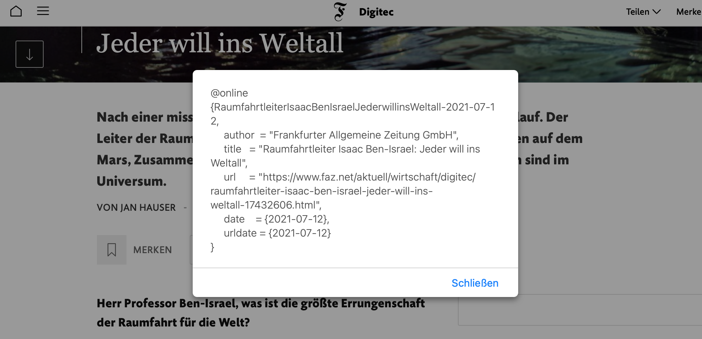

# DHBW.LaTeX_Template
Eine Vorlage für Studien-/Projekt-/Bachlorarbeiten an der DHBW. Im Dokument [DHBW_Template.pdf](DHBW_Template.pdf) sieht man das Kompilat mit Beispielen für die Verwendung.

**Inhalt**  
- [Features](#features)
- [Aufbau](#aufbau)
- [Auswahl und Anpassen des Deckblattes](#auswahl-und-anpassen-des-deckblattes)
  - [Projektvorlage](#projektvorlage)
- [Kapitel hinzufügen](#kapitel-hinzufügen)
- [Hinweis bei der Verwendung von Overleaf.com](#hinweis-bei-der-verwendung-von-overleafcom)
- [Website als Quelle mit HTML2BibLatex](#website-als-quelle-mit-html2biblatex)

## Features
Die LaTeX-Vorlage verfügt über die folgenden Features:
- Zentrale Konfiguration der Deckblätter über `main.tex`
- Modularer Aufbau für eine gute Lesbarkeit und leichte Erweiterbarkeit
- Automatisches Ausblenden von Abbildungs-, Tabellen- und Quellcode-Verzeichnis, wenn die entsprechende Tabelle leer ist.
- Beispiele für die Verwendung verschiedener LaTeX-Befehle

## Aufbau
| Verzeichnis/Datei | Beschreibung |
| --- | --- |
| `chapters/` | Ablageverzeichnis für die ausformulierten Kapitel/Texte der Arbeit |
| `etc/` | Verzeichnis für zusätzliche Dateien |
| `etc/acronyms.tex` | Abkürzungsverzeichnis |
| `etc/hyphenation.tex` | Auflistung von Wörtern mit ihrer Silbentrennung, wenn LaTex diese an der falschen Stelle trennt. |
| `etc/literature.bib` | Literaturverzeichnis |
| `img/` | Ablageverzeichnis für Bilder |
| `template/` | Verzeichnis für Vorlagen und Grundeinstellungen des Dokumentes |
| `template/title.tex` | Standarddeckblatt mit Angabe von DHBW-Betreuer und Zeitraum |
| `template/dhbw_coverpage_bachelor.tex` | Deckblatt für Bachelorarbeit (T3300) nach Vorgabe der DHBW |
| `template/dhbw_coverpage_projectreport` | Deckblatt für Projektarbeit (T3000) nach Vorgabe der DHBW |

## Auswahl und Anpassen des Deckblattes
Es gibt mehrere Deckblätter aus denen gewählt werden kann. Die voreingestellte Auswahl `title` ist für größere Arbeiten geeignet, welche die Angabe von Bearbeitungszeitraum und DHBW-Betreuer benötigen. Für Projekte (wie die T3000) kann das Template `dhbw_coverpage_projectreport` genutzt werden. Hier gibt es keine Angaben zur DHBW bis auf die Matrikelnummer.

In `main.tex` kann die Auswahl für das Deckblatt getroffen werden:
```LaTex
%% Titelseite
%% Layout mit Firmen und DHBW Angaben
\input{template/title}
%% Verwendung von Projekt-Deckblatt
%% \input{template/dhbw_coverpage_projectreport}
%% Verwendung von Projekt-Deckblatt
%% \input{template/dhbw_coverpage_bachelor}
```

Die Vorlagen sind so aufgebaut, dass im Verzeichnis `template` kaum Änderungen notwendig sind. Die Angaben wie Name, Titel der Projektarbeit ... werden in `main.tex` hinterlegt. Die Größe und Position von den Bildern auf dem Deckblatt muss im Template selbst angepasst werden.
Alle anderen Werte sind in der Datei `main.tex` in den ersten beiden Abschnitten konfigurierbar.

### Projektvorlage
Beispiel: [DHBW_ProjectReport_Template.pdf](DHBW_ProjectReport_Template.pdf)  
Bei der Verwendung der Vorlage `dhbw_coverpage_projectreport` müssen folgende Felder befüllt werden:
```LaTex
%% Student:
\newcommand{\myauthor}{Vorname Nachname}
\newcommand{\myhomestreet}{}
\newcommand{\myhomepostalnumber}{}
\newcommand{\myhometown}{}
\newcommand{\myid}{Matrikelnummer}

%% Titel und PDF-Einstellungen
\newcommand{\myworktype}{PROJEKTARBEIT}
\newcommand{\myworktitle}{}
\newcommand{\mytitle}{Projektarbeitsthema}
\newcommand{\mysubtitle}{ }
\newcommand{\mysubject}{T3\_3000 von Vorname Nachname}
\newcommand{\mykeywords}{Key, Word}

%% Dualer Partner
\newcommand{\mydualpartner}{Firmenname}
\newcommand{\mydualpartnerLocation}{Stadt}
\newcommand{\mysupervisor}{Titel Vorname Nachname}

%% Duale Hochschule
\newcommand{\myuniversity}{Dualen Hochschule Baden-Württemberg Mosbach}
\newcommand{\mycourse}{}
\newcommand{\mystudy}{Informatik}
\newcommand{\myevaluator}{}

%% Datum
\newcommand{\mysubmissionday}{1}
\newcommand{\mysubmissionmonth}{April}
\newcommand{\mysubmissionyear}{2020}

\newcommand{\myprocessingperiodbegin}{}
\newcommand{\myprocessingperiodend}{}
```

## Kapitel hinzufügen
Alle Kapitel werden in dem Verzeichnis `chapters` abgelegt. In `main.tex` werden diese Dateien als Input aufgelistet:  
```LaTeX
%% Add new chapters here
...
\input{chapters/myChapterName}
```

## Hinweis bei der Verwendung von Overleaf.com
Nach dem Hochladen der Dateien muss in den Einstellungen `main.tex` als **Main document** festgelegt werden.
Beim Hochladen gibt es die Option eine Zip-Datei auszuwählen.
Hier kann diese Verlage als Zip ausgewählt werden und erspart den manuellen Aufwand beim Anlegen der Verzeichnisstrukur.

## Website als Quelle mit HTML2BibLatex
Link zum offiziellen Repo: https://github.com/dmstern/html2biblatex

Den folgenden Code als Adresse bei einem neuen Lesezeichen hinterlegen:
```javascript
javascript:"use strict";(function(){var _document$querySelect,_document$querySelect2,_document$querySelect3;function copyToClipboard(text){window.prompt("Copy to clipboard: Ctrl+C, Enter",text)}function jsDate2bibTex(date){var dd=date.getDate();var mm=date.getMonth()+1;var yyyy=date.getFullYear();if(dd<10){dd="0"+dd}if(mm<10){mm="0"+mm}return yyyy+"-"+mm+"-"+dd}function date2YearTex(date){var yyyy=date.getFullYear();return""+yyyy}var title=document.title;var url=document.URL;var author_tag=document.querySelector("[name=author]");var author=author_tag==null?"":author_tag.content;var today=new Date;var urldate=jsDate2bibTex(today);var publishedTime=(_document$querySelect=document.querySelector('meta[property="article:published_time"'))===null||_document$querySelect===void 0?void 0:_document$querySelect.getAttribute("content");var someTimeTag=(_document$querySelect2=document.querySelector("time[datetime]"))===null||_document$querySelect2===void 0?void 0:_document$querySelect2.getAttribute("datetime");var someTimeTagWithoutDatetime=(_document$querySelect3=document.querySelector("time"))===null||_document$querySelect3===void 0?void 0:_document$querySelect3.innerHTML;var lastModifiedTime=document.lastModified;var pageTime=new Date(publishedTime||someTimeTag||someTimeTagWithoutDatetime||lastModifiedTime);var date=jsDate2bibTex(pageTime);var year=date2YearTex(pageTime);var title_key=title.replace(/[^0-9a-z]/gi,"");var citationKey=title_key+"-"+date;var type="@online";var filename=":./references/"+window.location.pathname.slice(1).replace(/\//g,"-")+".html:html";
const bibTexEntry = `${type} {${citationKey},\r
   author  = "${author}",\r
   title   = "${title}",\r
   url     = "${url}",\r
   date    = {${date}},\r
   urldate = {${urldate}}\r}`;;alert(bibTexEntry)})();
```
Der Code fügt im Gegensatz zum Quellcode vom offiziellen Repo Zeilenumbrüche für eine bessere Lesbarkeit ein.

Danke an [Jones1008](https://github.com/jones1008) für den Tipp und Code.



